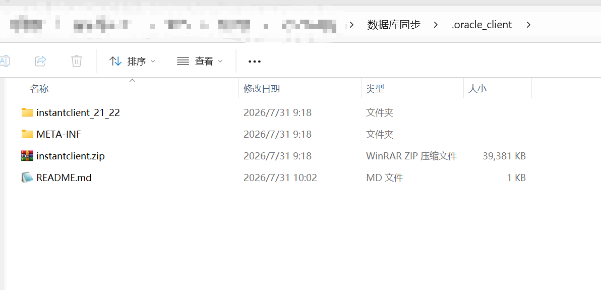

# Oracle Instant Client

此目录存放 Oracle Instant Client (thick 模式所需)。

由于体积较大(40MB+)，不纳入 git 管理。请用以下命令准备:

# PowerShell
$url = 'https://download.oracle.com/otn_software/nt/instantclient/2122000/instantclient-basiclite-windows.x64-21.22.0.0.0dbru.zip'
$zip = '.\instantclient.zip'
Invoke-WebRequest -Uri $url -OutFile $zip
Expand-Archive -Path $zip -DestinationPath . -Force
Remove-Item $zip

> 备用下载链接1 https://feishu.doubao.com/drive/file/UpO6bMgivon5CSxRuWEc7daAnQd
> 链接2: https://yun.139.com/shareweb/#/w/i/2wFGam2SspRdd  提取码:2qfw  

解压后此目录下应存在 instantclient_21_22 子目录。

